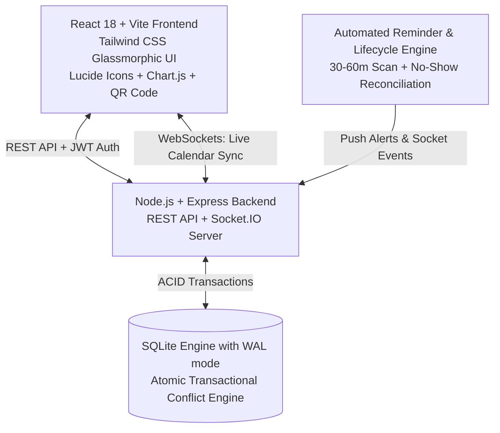

# ReserveHub — Smart Resource Booking Platform 🚀
**HackArena '26 — PS-3 | Domain: SaaS / Productivity | Difficulty: Medium**

ReserveHub is a centralized, real-time, self-service platform designed to eliminate double-bookings and optimize the utilization of shared institutional facilities (GPU AI computing labs, seminar halls, robotic testbeds, 3D printers, and sports arenas).

---

## 🌟 Key Features & Requirements Matrix

| Requirement | Description | Status |
|---|---|---|
| **FR1: Resource Catalogue with Details** | Filter by category, location, capacity, live status, and keyword search. | ✅ Complete |
| **FR2: Interactive Booking Calendar** | Day/Week slot grid with real-time visual statuses (Available, Booked, In-Use, Maintenance). | ✅ Complete |
| **FR3: Automatic Conflict Detection** | Atomic concurrency-safe SQL transaction engine preventing any double-booking. | ✅ Complete |
| **FR4: Booking History Per User** | Upcoming, In-Use, Completed, and Cancelled tabs with countdown timers and 1-click slot liberation. | ✅ Complete |
| **FR5: Admin Resource Management** | Full CRUD for institutional facilities + maintenance toggle + audit logging. | ✅ Complete |
| **FR6: Admin Booking Management** | Campus-wide booking oversight, filtering, and administrative dispute overrides. | ✅ Complete |
| **FR7: Role-Based Access Control (RBAC)** | JWT authentication with protected endpoints (`admin`, `student`, `faculty`). | ✅ Complete |
| **FR8: QR-Based Check-In (Bonus)** | Encrypted QR pass generator + interactive kiosk scanner marking bookings `checked-in` / `in-use`. | ✅ Complete |
| **FR9: Automated Reminders (Bonus)** | Background 30-60 min reminder scheduler + Web Audio tone chime + in-app notification center. | ✅ Complete |
| **FR10: Usage Analytics Dashboard (Bonus)** | Chart.js visualizations (Peak hours heatmap, Category breakdown, Most/Least booked ranking, CSV export). | ✅ Complete |
| **Real-Time WebSockets** | Socket.IO live sync updating all clients' calendars instantly upon booking/cancellation. | ✅ Complete |

---

## 🛠️ Architecture & Tech Stack



- **Frontend**: React 18, Vite, Tailwind CSS, Lucide React, Chart.js, `qrcode.react`, `canvas-confetti`.
- **Backend**: Node.js, Express, Socket.IO, `sql.js` (pure WebAssembly SQLite), JWT, `bcryptjs`.
- **Database**: SQLite with persistent disk backing, indexed foreign keys, and atomic overlap checking.

---

## 🚀 Quick Start Guide

### 1. Launch Backend Server
```powershell
cd server
npm.cmd install
node index.js
```
*Backend runs on `http://localhost:5000` with pre-seeded campus resources, accounts, and sample bookings.*

### 2. Launch Frontend Client
```powershell
cd client
npm.cmd install
npm.cmd run dev
```
*Frontend runs on `http://localhost:3000`.*

---

## 👥 Demo Pre-Seeded Accounts

Use the **1-Click Demo Role Switcher** in the top navigation bar or log in with:

| Role | Email | Password | Permissions |
|---|---|---|---|
| 👑 **Admin / Manager** | `admin@campus.edu` | `Admin@123` | Resource CRUD, Dispute Override, Executive Analytics |
| 🎓 **Student** | `student@campus.edu` | `Password@123` | Browse, Book, View QR Pass, Check-In, Cancel |
| 🔬 **Faculty / Staff** | `faculty@campus.edu` | `Password@123` | Browse, Priority Reservations, Check-In |

---

## 🧪 Verification & Automated Test Suite

Run the full end-to-end requirement test suite:
```powershell
cd server
node test/e2e_verification.js
```
*Outputs 26/26 passed test assertions across all functional and non-functional requirements.*
